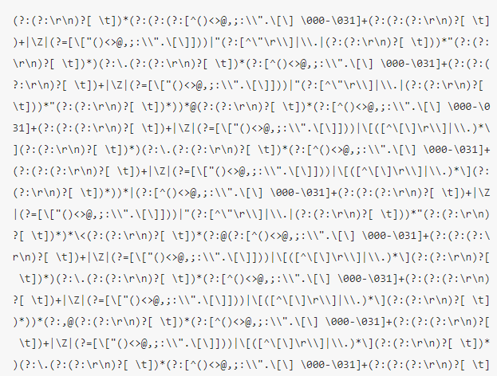
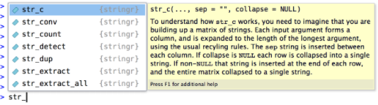

class: center, middle

.linea-superior[]
.linea-inferior[]


## Capacitación en R y herramientas de productividad - nivel intermedio

## Proyecto Ciencia de Datos

## Strings y Regex

```{r setup, include=FALSE}
options(htmltools.dir.version = TRUE)
knitr::opts_chunk$set(message = FALSE) 
```

```{r xaringan-themer, include=FALSE, warning=FALSE}
library(xaringanthemer)
#style_duo_accent(
 # primary_color = "#1381B0",
  #secondary_color = "#FF961C",
  #inverse_header_color = "#FFFFFF"
#)
```

---

background-image: url("imagenes/fondo2.PNG")
background-size: contain;
background-position: 100% 0%

# Manejo de strings

--
<br/>

.medium-par[Introducción al manejo de strings⛓️ y `stringr`🎻]
<br/>
<br/>

--

.medium-par[Expresiones regulares 📏]
<br/>
<br/>

--

.medium-par[Aplicaciones para la exploración y edición de strings 🪓🔨]
<br/>
<br/>

---

background-image: url(imagenes/patterns.PNG)
background-size: contain


.center[.big-par-red[Introducción al manejo de strings⛓️ y `stringr`🎻️]]

---

background-image: url("imagenes/fondo2.PNG")
background-size: contain;
background-position: 100% 0%

# Manejo de strings

--
<br/>

.center[.big-par[¿Qué son las .pur[strings]?🤔]]

--

.center[.big-par[¿Creen que es importante saber .pur[manipular strings]? ¿Por qué?]]

--

.center[.medium-par[¿Qué tareas de su trabajo creen que podrían .pur[optimizar]?]]

--

.center[.big-par[🤔]]

---


background-image: url("imagenes/fondo2.PNG")
background-size: contain;
background-position: 100% 0%

# Manejo de strings

--
<br/>

Probablemente en su experiencia programando, con `R` u otro *software*, han .pur[creado] o .pur[manipulado] strings (o cadenas de caracteres) en alguna ocasión.

--

Una forma sencilla de crear una string es utilizando .pur[comillas] (").

--

.pur[**nota**: al encerrar entre paréntesis el código logramos **asignar** e **imprimir** en una sola línea.]

--

```{r}
(mi_string <- "hola, soy una string")
```

--

También se pueden crear con .pur[comillas simples] (').

--

```{r}
(mi_string <- 'hola, yo también soy una string')
```

---

background-image: url("imagenes/fondo2.PNG")
background-size: contain;
background-position: 100% 0%

# Manejo de strings

--
<br/>

¿Qué pasa si necesitamos usar comillas dentro de una string?

--

```{r, error=T}
(mi_string <- "quiero incluir "comillas" dentro de una string")
```

--

Al volver a abrir comillas, `R` entiende que con eso se .pur[cierran las primeras comillas].

--

Por eso es recomendable **reservar** las comillas simples ('') para cuando hay comillas ("") al interior de la string.

--

```{r}
(mi_string <- 'quiero incluir "comillas" dentro de una string')
```
--

Si se fijan, el valor .pur[impreso] agrega el símbolo "\" antes de cada comilla.

---

background-image: url("imagenes/fondo2.PNG")
background-size: contain;
background-position: 100% 0%

# Manejo de strings

--
<br/>

Una secuencia .pur[dentro de una string] que comienza con "\" es llamada .pur[*scape sequence*]. 

--

Avisan a `R` que debe interpretar el input inmediatamente posterior a "\" de otra manera.

--

Podemos directamente ingresar "**\"**" en vez de comilla simple (') y `R` .pur[interpretará] e .pur[imprimirá] lo mismo. 

--

```{r}
(mi_string <- "quiero incluir \"comillas\" dentro de una string")
```

--
<br/>

.center[.red[Warning: ]Pero 👁️,la representación impresa de una cadena no es equivalente a la cadena misma ..red[Warning]]

---

background-image: url("imagenes/fondo2.PNG")
background-size: contain;
background-position: 100% 0%

# Manejo de strings

--
<br/>

La función `writeLines()` muestra las strings como deben ser leídas, independiente de cómo `R` las almacena.

--

```{r}
writeLines(mi_string)
```

--

```{r}
(mi_string <- "quiero que mi string se \ndespliegue en distintas líneas")
```
--

```{r}
writeLines(mi_string)
```

---

background-image: url("imagenes/fondo2.PNG")
background-size: contain;
background-position: 100% 0%

# Manejo de strings

--

```{r}
(mi_string <- "quiero \t agregar \t \"tabs\" \na mi \tstring")
```
--

```{r}
writeLines(mi_string)
```

--

Entonces, si quiero obtener un "\" dentro de mi string, debo ingresar "\\\".

--

```{r}
ejemplo <- c("\"", "\\")
writeLines(ejemplo)
```

--

Ahora, si bien estos símbolos y secuencias permiten .pur[generar strings] con ciertas características.

--

.center[Su mayor utilidad es .medium-par[.pur[rastrear patrones en strings] 🔎]]


---

background-image: url("imagenes/fondo2.PNG")
background-size: contain;
background-position: 100% 0%

# Expresiones regulares (regex)

--

Para el manejo de strings pondremos énfasis en las expresiones regulares (o .pur[regex]).

--

una **regex:** es una .pur[secuencia de caracteres que conforma un patrón de búsqueda] ([wikipedia](https://es.wikipedia.org/wiki/Expresi%C3%B3n_regular)).

--

Las .pur[regex] resultan útiles porque permiten describir patrones en ellas a través de un .pur[lenguaje conciso].

--

.red[Warning:] Cuando mires por primera vez una regex te parecerá que un gato caminó sobre tu teclado.

--

.pull-left[]

--

.pull-right[]

---

background-image: url("imagenes/fondo2.PNG")
background-size: contain;
background-position: 100% 0%

# Expresiones regulares (regex)

--
<br/>

.medium-par[Pero a medida que vayas ampliando tu conocimiento pronto te empezarán a hacer sentido.]

--

Este es un trozo de una expresión regular que evalúa si una dirección de correo electrónico es válida.

.center[

]

fuente: [R para ciencia de datos](https://r4ds.had.co.nz/strings.html)

---

background-image: url("imagenes/fondo2.PNG")
background-size: contain;
background-position: 100% 0%

# Manejo de strings

--
<br/>

Hadley Wickham llama a lo anterior un **ejemplo patológico** porque las direcciones de correo pueden ser muy complejas.

--

Las herramientas que aprenderemos hoy son .pur[muchísimo más sencillas pero muy potentes].

--

.pull-left[

.medium-par[Para la manipulación de strings utilizaremos una librería parte de `tidyverse`.]

.medium-par[Esta librería se llama `stringr`.]]

--

.pull-right[]

---

background-image: url("imagenes/fondo2.PNG")
background-size: contain;
background-position: 100% 0%

# Manejo de strings con `stringr`

--
<br/>

`stringr` está construido sobre la base del paquete `stringi`. 

--

`stringi` está diseñado para ser **comprehensivo** (256 funciones).

--

`stringr` contiene una selección .pur[precisa] de las funciones más útiles, lo que lo hace más .pur[conciso] y .pur[consistente] (49 funciones).

--

`stringr` es .pur[compatible con la gramática de `tidyverse`] y presenta .pur[argumentos predeterminados razonables].

--

Si llegaran requerir de más herramientas, vale la pena mirar `stringi`, aunque probablemente la mejor inversión es aprender más sobre **regex**.

--

Algo que facilita rastrear las funciones de `stringr` en `RStudio` es que todas comienzan con "**str_**".

--
<br/>

.center[

]

---

background-image: url("imagenes/fondo2.PNG")
background-size: contain;
background-position: 100% 0%

# Manejo de strings con `stringr`

--
<br/>

`stringr` ofrece versiones de algunas funciones que ya conocemos del paquete base.

--

(Para trabajar con `stringr` basta con cargar `tidyverse`.)

--

```{r}
library(tidyverse)
frutas = c("mazana", "naranja", "uva", "platano", "pera", NA)
```

--

Podemos .pur[contar la cantidad de caracteres] dentro de cada string.

--

```{r}
# con stringr
str_length(frutas)
# con R base
nchar(frutas)
```

---

background-image: url("imagenes/fondo2.PNG")
background-size: contain;
background-position: 100% 0%

# Manejo de strings con `stringr`

--
<br/>

`stringr` también tiene su propia versión de `paste()`.

--

```{r}
# con stringr
str_c(c("x", "y", "z"), collapse = ", ")
# o con R base
paste(c("x", "y", "z"), collapse = ", ")
```

---

background-image: url("imagenes/fondo2.PNG")
background-size: contain;
background-position: 100% 0%

# Manejo de strings con `stringr`

--
<br/>

De la mayoría de las funciones de `stringr` que veremos a continuación, .pur[existe una versión en `R` base].

--

```{r, echo = F}
library(kableExtra)
equivalencia = tibble(stringr = c("str_detect(x, pattern)", "str_sub(x, start, end)", "str_length(x)",
                                      "str_match(x, pattern)", "str_extract(x, pattern)", 
                                      "str_to_lower(x)", "str_to_upper(x)"),
                      base = c("grepl(pattern, x)","substr(x, start, end)", "nchar(x)",
                                   "regexec(pattern, x) + regmatches()", "regexpr(pattern, x) + regmatches()",
                                   "tolower(x)", "toupper(x)"))

equivalencia %>% kable()

```

--

Escogimos solo algunas de las equivalencias que existen entre `stringr` y `R` base.

--

Para conocer más acerca de `stringr` puedes pinchar [aquí](https://stringr.tidyverse.org/).

---

background-image: url("imagenes/fondo2.PNG")
background-size: contain;
background-position: 100% 0%

# Manejo de strings con `stringr`

--
<br/>

Veamos algunos ejemplos de usos de las funciones de `stringr`.

--

Podemos .pur[extraer] los números de una dirección.

--

```{r}
str_extract("Paseo Bulnes 418", pattern = "\\d+")

```

--

O podríamos querer, por el contrario, .pur[remover] los números.

--

```{r}
direcciones <- c("Avenida Libertador Bernardo O'Higgins 1058" , 
                 "Calle Morandé 801", "Calle Paseo Bulnes 2018")

str_replace(direcciones, pattern = c("\\s\\d+"), replacement = "")
```

--

¿Alguien intuye lo que hace **"\\\s\\\d+"**?

---

background-image: url("imagenes/fondo2.PNG")
background-size: contain;
background-position: 100% 0%

# Manejo de strings con `stringr`

--
<br/>

O bien.

--

```{r}
str_extract(direcciones, pattern = "\\D+")
```

--

¿Qué hizo **"\\\D+"**?

--

Quizás .pur[no nos interesa] la denominación de calle o avenida y queremos solo el nombre y número.

--

```{r}
str_replace(direcciones , pattern = "Calle|Avenida", replacement = "")
```


¿Es robusta esa solución? ¿Qué pasaría si hubiera un "Pasaje"?

---

background-image: url("imagenes/fondo2.PNG")
background-size: contain;
background-position: 100% 0%

# Manejo de strings con `stringr`

<br/>

--

```{r}
str_replace(direcciones , pattern = "^\\w+\\s", replacement = "")
```

--

¿Qué creen que hace esta regex **"^\\\w+\\\s"**?

---

background-image: url("imagenes/fondo2.PNG")
background-size: contain;
background-position: 100% 0%

# Expresiones regulares (regex)

--
<br/>

Partamos desde el principio con las .pur[regex].

--

No revisaremos hoy .medium-par[todas] las .pur[regex], porque son .medium-par[.pur[demasiadas]], solo veremos elementos básicos.


Para conocer más detalles sobre las .pur[regex] y su uso en `stringr` pueden pinchar [aquí](https://stringr.tidyverse.org/articles/regular-expressions.html).

--

También pueden visitar un recurso en español [aquí](https://rpubs.com/ydmarinb/429756) o [aquí](https://www.diegocalvo.es/expresiones-regulares-en-r/)

--

Echemos un vistazo en este último recurso 👀.

---

background-image: url("imagenes/fondo2.PNG")
background-size: contain;
background-position: 100% 0%

# Expresiones regulares (regex)

--

Volvemos a crear nuestro vector frutas.

--

```{r}
frutas <- c("mazana", "naranja", "uva", "platano", "pera")
```

--

Lo más básico es consultar si las strings .pur[contienen] una string completa.

--

```{r}
str_match(frutas, pattern = "uva")
```

--

O si .pur[contienen] un patrón, **en cualquier lugar**.

--

```{r}
str_view(frutas, pattern = "an")
```

---

background-image: url("imagenes/fondo2.PNG")
background-size: contain;
background-position: 100% 0%

# Expresiones regulares (regex)

--

También podemos rastrear una string con un caracter opcional.

--

```{r}
nombres = c("maria", "mario", "camilo", "camila")
str_detect(nombres, pattern = "mari(o|a)")
```

## Anclas

--

Existen dos operadores que anclan una posición.

--

- **^** para buscar la coincidencia al inicio de la cadena.
- **$** para buscar la coincidencia al final de la cadena.

--

Queremos saber qué nombres parten con "c" y luego los que terminan con "o".

```{r}
str_detect(nombres, pattern = "^c")
str_detect(nombres, pattern = "o$")
```

---

background-image: url("imagenes/fondo2.PNG")
background-size: contain;
background-position: 100% 0%

# Ejercicio (no tan) express

--

Estas herramientas que hemos visto pueden usarse en conjunto con las que ya conocen de `dplyr` (`filter()`, `mutate()`)

--

Trabajaremos con la base del paquete `guaguas` que ya hemos utilizado anteriormente.

--

```{r}
library(guaguas)
```

--

**Ejemplo:** Si queremos detectar y tabular solamente a las personas que en su nombre contienen el patrón "eta", podríamos hacerlo así.

--

```{r}
guaguas %>% 
  filter(str_detect(nombre, pattern = "eta")) %>%
  count(nombre)
```

---

background-image: url("imagenes/fondo2.PNG")
background-size: contain;
background-position: 100% 0%

# Ejercicios (no tan) express

--

Ahora ustedes:

--

1. Tabular los nombres solo de las mujeres que tienen un nombre terminado en "o" nacidas el mismo año que tú.

--

2. Tabular los nombres solo de los hombres que tienen un nombre terminado en "a" nacidos el mismo año que tú.

--

3. Nombres de personas que su nombre termine con "e", con o sin acento, nacidas el mismo año que tú.

--

4.1 Primero, separa la base guaguas en una lista que contenga un data frame para cada año (anio).

--

4.2 Construye una función que cree dos nuevas variables en un data frame:

**"first_letters"**, que contenga las primeras 2 letras de cada nombre y 
**"last_letters"**, que contenga las últimas 2 letras de cada nombre. 
    
(👀 esto NO lo hemos visto, revisen la función `str_sub()`)

--

4.3 Recorre la lista de data frames por año aplicando tu función.

---

background-image: url("imagenes/fondo2.PNG")
background-size: contain;
background-position: 100% 0%

# Ejercicio (no tan) express: solución

--

(1) Tabular los nombres solo de las mujeres que tienen un nombre terminado en "o".

```{r}
guaguas %>% 
  filter(sexo == "F" & anio == 1985 & str_detect(nombre, "o$")) %>%
  count(nombre)
```

---

background-image: url("imagenes/fondo2.PNG")
background-size: contain;
background-position: 100% 0%

# Ejercicio (no tan) express: solución


(2) Tabular los nombres solo de los hombres que tienen un nombre terminado en "a".

```{r}
guaguas %>% 
  filter(sexo == "M" & anio == 1985 & str_detect(nombre, "a$")) %>%
  count(nombre)
```

---

background-image: url("imagenes/fondo2.PNG")
background-size: contain;
background-position: 100% 0%

# Ejercicio (no tan) express: solución

(3) Nombres de personas que su nombre termine con "e", con o sin acento.

```{r}
guaguas %>% 
  filter(anio == 1985 & str_detect(nombre, "(e|é)$")) %>% 
  count(nombre)
```

---

background-image: url("imagenes/fondo2.PNG")
background-size: contain;
background-position: 100% 0%

# Ejercicio (no tan)  express: solución

--

4.1 Primero, separa la base guaguas en una lista que contenga un data frame para cada año (anio).

```{r}
list_anio = split(guaguas,  guaguas$anio)
```

--

4.2 Construye una función que cree dos nuevas variables en un data frame:

```{r}
create_first_last = function(df, var){
  df %>% 
    mutate(first_letters = str_sub({{var}}, 1, 2),
           last_letters = str_sub({{var}}, -2, -1))
}
```

--

4.3 Recorre la lista de data frames por año aplicando tu función.

```{r}
map(list_anio, create_first_last, nombre)
```


---

background-image: url("imagenes/fondo2.PNG")
background-size: contain;
background-position: 100% 0%

# Otras expresiones regulares (regex)

<br/>
--

Vamos a revisar algunas de las expresiones regulares más utilizadas.

--

Primero intentaremos interpretarlas en base a la .pur[intuición].

--

```{r, echo = F}
regex1 = data.frame(symbol = c("\\\\d", "[:digit:]", "[0-9]", "\\\\w", "[:word:]", "[A-Z]", "[a-z]", 
                              "[A-Za-z]", "[:alpha:]", "[aeiou]", '\\\\s', "(?i)"),
                   mean = c(" ", " "," ", " " , " ", " "," ", " ", " "," ", " ", " "))
regex1 %>% kable()

```

---

background-image: url("imagenes/fondo2.PNG")
background-size: contain;
background-position: 100% 0%

# Otras expresiones regulares (regex)

--

```{r, echo = F}
regex2 = data.frame(symbol = c("a+", "a*", "a?", "\\d{n}", "a{n,m}", "a{,m}", "a{n,}", "[:punct:]","[^ab]",
                               "[^0-9]", "\\D", "\\W", "\\S", "^a", "a$"),
                   mean = c(" ", " ", " ", " ", " ", " ", " ", " ", " ", " ", " ", " ", " ", " ", " "))
regex2 %>% kable()

```

---

background-image: url("imagenes/fondo2.PNG")
background-size: contain;
background-position: 100% 0%

# Otras expresiones regulares (regex)

--

Vamos a revisar algunas de las expresiones regulares más utilizadas

```{r, echo = F}
regex1 = data.frame(symbol = c("\\\\d", "[:digit:]", "[0-9]", "\\\\w", "[:word:]", "[A-Z]", "[a-z]", 
                              "[A-Za-z]", "[:alpha:]", "[aeiou]", '\\\\s', "\\\\S", "(?i)"),
                   mean = c("coincide con números", "coincide con números","coincide con números", 
                            "coincide con letras, números y guiones bajos", "coincide con letras, números y guiones bajos",
                            "coincide con letras mayúsculas", "coincide con letras minúsculas", 
                            "coincide con letras mayúsculas y minúsculas",
                            "coincide con letras mayúsculas y minúsculas", 
                            "entre parentesis cuadrados se pueden crear patrones personalizados",
                            "coincide con espacios", "distinto de espacios", "case insensitive"))
regex1 %>% kable()

```

---

background-image: url("imagenes/fondo2.PNG")
background-size: contain;
background-position: 100% 0%

# Otras expresiones regulares (regex)

--

```{r, echo = F}
regex2 = data.frame(symbol = c("a+", "a*", "a?", "\\d{n}", "a{n,m}", "a{,m}", "a{n,}", "[:punct:]","[^ab]",
                               "[^0-9]", "\\D", "\\W", "\\S", "^a", "a$"),
                   mean = c("a al menos una vez", "a cero o más veces", 
                            "a cero o una vez (valor opcional)", "entre corchetes se indica una cantidad esperada",
                            "primer valor es mínimo y segundo el máximo", "solo el máximo está definido", 
                            "solo el mínimo está definido", "coincide con caracteres de puntuación y símbolos especiales",
                            "distinto de a o b", "distinto de número", "distinto de dígito", 
                            "distinto de letras, números y guiones bajos", "distinto de espacio",
                            "a está al principio", "a está al final"))
regex2 %>% kable()

```

---

background-image: url("imagenes/fondo2.PNG")
background-size: contain;
background-position: 100% 0%

# Hagamos ejercicios con texto libre

--

Vamos a utilizar una interfaz gráfica que interpreta expresiones regulares.

--

.center[

]

--

No tiene un intérprete de regex en R, pero .pur[las regex se implementan de forma similar en distintos lenguajes].

--

Para acceder a la interfaz pincha [aquí](https://regex101.com/r/wv8RnO/1).

---

background-image: url("imagenes/fondo2.PNG")
background-size: contain;
background-position: 100% 0%

# Hagamos ejercicios con texto libre

--

Utilizaremos el siguiente texto para explorar:

--

```{r, eval = F}
Hoooola, mi nombre es Ignacio, soy sociólogo de formación y trabajo en el INE hace ya algunos años... 
Mi teléfono es: +569 87622455 /
Mi correo electrónico del trabajo es <ifaglonij@ine.gob.cl> 
Uno de mis correos personales es: <ignacio.aglonij@gmail.com> 
Como le pasa a mucha gente, el primer correo electrónico que tuve no era muy serio...<gatoflojo@hotmail.cl>  
Mi dirección es Paseo Bulnes 418, piso 1. Mmmm, ¿qué más les puedo contar? 
Estoy haciendo un posgrado (o postgrado, no sé cómo se dice), un master en Tecnologías de la Información en la U de Chile y no doy fe de lo que digo aquí sea verdad... (quizas una que otra cosa sí)

Esto si que es cierto:
Nro tarjeta de crédito: 6753 9870 8768 8976
Fecha de vencimiento: 06/25
Número de seguridad: 896
```

--

Cópienlo y péguenlo en la interfaz de **regex**.

--

Veamos si funcionan algunas de las **regex** que revisamos.


---

background-image: url("imagenes/fondo2.PNG")
background-size: contain;
background-position: 100% 0%

# Hagamos ejercicios con texto libre

--

.pur[.big-par[Ahora ustedes:]]

--

- Detecta el saludo "Hola", independiente de lo coloquial que sea (de la cantidad de "o"). Prueba dos formas de regex.

--

- Capta tanto la palabra "posgrado" como "postgrado". Prueba dos formas de regex.

--

- Detecta la expresión "Mmmm".

--

- Detecta el patrón del número de celular completo.

--

- Valida el patrón de los correos gmail y hotmail.

--

- Valida el patrón de un correo INE (@ine.gob.cl).

--

- Detecta un patrón de número de tarjeta de crédito.

--

- Detecta una fecha de vencimiento de una tarjeta de crédito.


---

background-image: url("imagenes/fondo2.PNG")
background-size: contain;
background-position: 100% 0%

# Hagamos ejercicios con texto libre

--

.pur[.big-par[Respuestas:]]

--

- Detecta el saludo "Hola", independiente de lo coloquial que sea (de la cantidad de "o"). Prueba dos formas de regex.

```{r, eval = F}
Ho+la | Ho*la 
```

--

- Capta tanto la palabra "posgrado" como "postgrado". Prueba dos formas de regex.

```{r, eval = F}
post?grado | po(s|st)grado
```

--

- Detecta la expresión "Mmmm".

```{r, eval = F}
(?i)(Mm+)
```

--

- Detecta el patrón del número de celular completo.

```{r, eval = F}
\+\d{3}\s\d{8}
```


---

background-image: url("imagenes/fondo2.PNG")
background-size: contain;
background-position: 100% 0%

# Hagamos ejercicios con texto libre

--

.pur[.big-par[Respuestas:]]

--

- Valida el patrón de los correos gmail y hotmail.

```{r, eval = F}
\w+\.?\w+\@\w+.\w{2,3}
```

--

- Valida el patrón de un correo INE (@ine.gob.cl).

```{r, eval = F}
[a-z]+\@[a-z]{3}.[a-z]{3}.[a-z]{2}
```

--

- Detecta un patrón de número de tarjeta de crédito.

```{r, eval = F}
([0-9]{4}\s){3}[0-9]{4}
```

--

- Detecta una fecha de vencimiento de una tarjeta de crédito.

```{r, eval = F}
[0-9]{2}/[0-9]{2}
```

---

background-image: url("imagenes/fondo2.PNG")
background-size: contain;
background-position: 100% 0%

# Otras aplicaciones con regex

--

Utilizaremos la base de datos "telefonos".

--

**Nota:** base de datos y ejemplos tomados de charla de Riva Quiroga Steph Orellana en Latin R 2020.

--

```{r}
library(readr)
telefonos <- read_csv("data/telefonos.csv")
```

--

.medium-par-red[¿Qué pueden observar sobre la variable "ciudad"?]

--

```{r}
telefonos %>% 
  count(ciudad)
```

---

background-image: url("imagenes/fondo2.PNG")
background-size: contain;
background-position: 100% 0%

# Otras aplicaciones con regex

--
<br/>

Las ciudades están escritas de distinta manera. Esto es muy propio de los RRAA, cuando las personas ingresan sus propios datos.

--

Para poder captar a todas las observaciones de Quilpué debemos hacer lo siguiente.

--

```{r}
telefonos %>% 
  filter(str_detect(ciudad, "quilpu(e|é)"))
```

---

background-image: url("imagenes/fondo2.PNG")
background-size: contain;
background-position: 100% 0%

# Otras aplicaciones con regex

--

.medium.par[¿Cómo podrías captar a todas las menciones de Valparaiso?]

--

```{r}
telefonos %>% 
  filter(str_detect(ciudad, "(?i)valpara[i|í]so")) %>% 
  count(ciudad)
```

--

También observamos que "La Serena" está referido de dos formas diferentes. 


```{r}
telefonos %>% 
  filter(str_detect(ciudad, "Serena")) %>% 
  count(ciudad)

```

---

background-image: url("imagenes/fondo2.PNG")
background-size: contain;
background-position: 100% 0%

# Ejercicio express

--

1- .medium-par[¿Cómo lo harían para homologar la ciudad en una variable limpia?]

--

**hint:** pueden usar `case_when()` para crear una variable limpia `ciudad_clean`.

--

2- Como pueden observar, los teléfonos no están en un solo formato.

--

```{r}
telefonos %>% select(numero_telefonico) %>% head()
```
  
Podemos usar las herramientas aprendidas para homologar el formato, eliminando los números que son estandar en una nueva variable `fono_clean`.

---

background-image: url("imagenes/fondo2.PNG")
background-size: contain;
background-position: 100% 0%

# Ejercicio express

--

.pur[.big-par[Respuestas:]]

--

1- Limpieza ciudad.

```{r}
telefonos = telefonos %>% 
  mutate(ciudad_clean = case_when(
    str_detect(ciudad, "(?i)valpara[i|í]so") ~ "Valparaíso",
    str_detect(ciudad, "quilpu[e|é]") ~ "Quilpué",
    str_detect(ciudad,"Serena") ~ "La Serena",
    TRUE ~ as.character(ciudad)))

telefonos %>% count(ciudad_clean)
```

---

background-image: url("imagenes/fondo2.PNG")
background-size: contain;
background-position: 100% 0%

# Ejercicio express

--

.pur[.big-par[Respuestas:]]

--


2- Limpieza fono.

```{r}
telefonos = telefonos %>%
  mutate(fono_clean = str_sub(numero_telefonico, start = -8 , end = -1))
telefonos %>% 
  select(numero_telefonico, fono_clean) %>% 
  head()
```

---

background-image: url("imagenes/fondo2.PNG")
background-size: contain;
background-position: 100% 0%

# Otras aplicaciones con regex

--
<br/>

.medium-par[Como pueden ver, las utilidades de las .pur[regex] y de stringr son casi infinitas].

--

.medium-par[Las regex permiten la .pur[automatización] de muchas tareas de .pur[validación y depuración] de datos].

--

.medium-par[Es muy difícil manejar todas las herramientas, lo importante es .pur[entender su lógica y saber buscar]].

---

background-image: url("imagenes/fondo2.PNG")
background-size: contain;
background-position: 100% 0%

# Ejercicio para la 🏠

--

A partir de la base de datos de la encuesta Casen 2020, disponible en la carpeta de la clase de hoy "casen_2020_edit.feather", realice las siguientes tareas

```{r, eval = F}
library(feather)
library(tidyverse)

casen = read_feather("data/casen_2020_edit.feather")
```

1- Ayudándote de expresiones regulares, y de la manera más suscinta que puedas, selecciona todas las variables de cuestionario de:

    - el módulo de Ocupación
    - el módulo de vivienda

El output debe ser una tabla solo con las variables de cada módulo, por separado.

**nota:** puedes omitir las variables construidas ex-post en cada módulo.

---

background-image: url("imagenes/fondo2.PNG")
background-size: contain;
background-position: 100% 0%

# Ejercicio para la 🏠

--

2- La tabla "casen_2020_edit.feather" contiene las variables `o9a`, `o9b` y `o24`, que representan, respectivamente, "ocupación", "tareas en la ocupación" y "rama de actividad económica" de las personas que declaran estar ocupadas en el periodo de referencia.

Estas variables son utilizadas como insumo para la codificación automática de los clasificadores de ocupación y rama de actividad económica.

Crea una función que reciba como argumento una variable character y la procese de la siguiente manera:
    - Pase todos los caracteres de una glosa a minúscula
    - Remueva todos los signos de puntuación y caracteres especiales
    - Remueva todos los números
    - Extraiga espacios adicionales entre palabras
    - Remueva *stopwords* (para esto pueden usar las librerías `tm`, `quanteda`, entre otras)
    
La función debe retornar una variable con glosas procesadas.

No es necesario que evalúes tu función, basta con el código 😁

---

background-image: url("imagenes/fondo2.PNG")
background-size: contain;
background-position: 100% 0%

# Ejercicio para la 🏠

<br/>

--

Las tareas deberán ser entregadas a través de git. En el repositorio de gitlab que hemos estado usando existe una rama llamada tareas, en la cual hay una carpeta para cada clase. Hagan fetch (o pull) de esa rama y empujen sus tareas a la carpeta correspondiente. La estructura del archivo debe ser la siguiente: nombre_apellido1_apellido2.R

La url es la siguiente: https://github.com/clase-git/clase-curso-bulnes2

**Nota: Es deseable que las tareas solo contengan funciones**

---

background-image: url("imagenes/fondo2.PNG")
background-size: contain;
background-position: 100% 0%

# Referencias

.medium-par[Nada de esto sería posible sin:]

- [Tutorial de Stringr](https://stringr.tidyverse.org/)

- [Expresiones regulares en R, Diego Calvo](https://www.diegocalvo.es/expresiones-regulares-en-r/)

- [Expresiones regulares en R, Yubar Marín](https://rpubs.com/ydmarinb/429756)

- [R for Data Science, de Hadley Wickham, , capítulo 14](https://r4ds.had.co.nz/)

- [Advanced R, de Hadley Wickham](http://adv-r.had.co.nz/Introduction.html)

- [Introduction to R, de Data Carpentry](https://datacarpentry.org/R-genomics/01-intro-to-R.html#functions)

- [Xaringan: Presentation Ninja, de Yihui Xie](https://github.com/yihui/xaringan). Para generar esta presentación con la plantilla ninja ⚔

.medium-par[R for Data Science tiene una traducción al español realizada por la comunidad hispana de R:]

- [R para ciencia de datos, de Hadley Wickham, capítulo 14](https://es.r4ds.hadley.nz/)

---

class: center, middle

.linea-superior[]
.linea-inferior[]


## Capacitación en R y herramientas de productividad - nivel intermedio

## Proyecto Ciencia de Datos

## Strings y Regex

